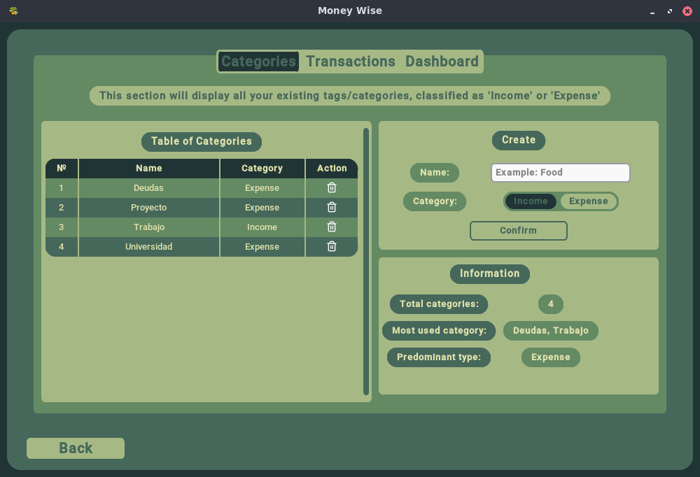
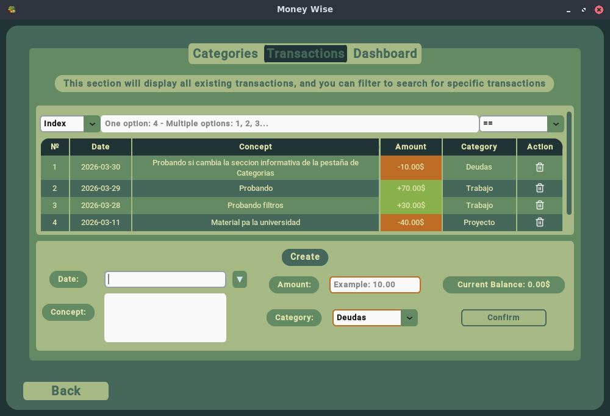
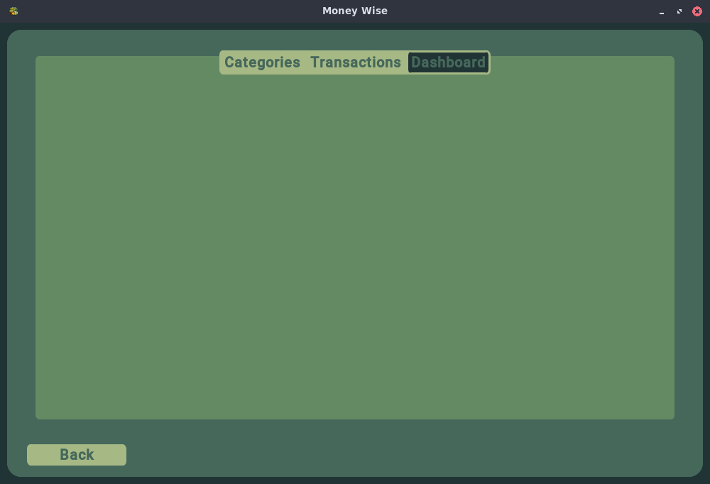

# MoneyWise

[](https://www.python.org/)
[](LICENSE)
[](https://github.com/SrSherman333/money-wise)
[](https://github.com/SrSherman333/money-wise/commits/main)

**MoneyWise manages your finances from creating Categories, through creating Transactions, and accessing a Dashboard tab where you can see a summary of text and graphs - UTMACH CDIA**

<div align="center">
  
</div>

## Key Features

- **Three tabs** with their respective interfaces and functions
- **Modern graphical interface** with CustomTkinter
- **Console version** for quick use
- **Persistence**: Data is stored locally in an SQLite database (`.sqlite3` file), without the need for external servers
- **Interactive tables** that display categories and created transactions
- **Robust error handling** and input validation
- **Modular** and well-documented code
- **Real-time state changes** with the interactive table (Create/Edit/Delete)
- **Relevant information** in labels such as most used categories, current balance, colors to better differentiate between transactions that are expenses or income, etc.
- **Using pandas** for information management

## Description of each tab

| #   | Tab              | Description                                                                                                                                                                                                                                                                                                                                                                                                                                                                                                                                                                                                                      |
| --- | ---------------- | -------------------------------------------------------------------------------------------------------------------------------------------------------------------------------------------------------------------------------------------------------------------------------------------------------------------------------------------------------------------------------------------------------------------------------------------------------------------------------------------------------------------------------------------------------------------------------------------------------------------------------- |
| 1   | Categories Tab   | This feature displays user-created categories in a table for later use in the Transactions tab. These categories can be classified into two types: Income or Expense. Existing categories can also be edited or deleted by interacting directly with the table. Clicking on a category name will enter "Edit" mode, and the data will be transferred to the form on the same tab, allowing for editing. The same process applies to deleting categories. Finally, an information box displays: the total number of categories, the most frequently used category(ies), and the predominant type                                  |
| 2   | Transactions Tab | This feature displays user-created transactions in a table, allowing users to categorize them based on the categories created in the previous tab. Depending on the selected category, the amount cell will be colored accordingly, indicating whether it's an expense or income. This table offers the same interactivity as the categories table, functioning in the same way. A search bar is also included to facilitate transaction searches, allowing filtering by each column in the table. Finally, an informational label displays the current balance, which dynamically updates based on the edited or entered amount |
| 3   | Dashboard Tab    | This tab is still under development but will eventually contain important information about the money deposited, including various graphs to better appreciate the results                                                                                                                                                                                                                                                                                                                                                                                                                                                       |

## Galery

<div align="center">
  <p>Main Interface</p>
  <p>Categories Tab</p>
  <p>Transactions Tab</p>
  <p>Dashboard Tab (In development)</p>
  <br>
</div>

## Installation and use

### Prerequisites

- Python 3.8 or higher
- pip (python package manager)

### Installation

Clone the repository

```bash
git clone https://github.com/SrSherman333/money-wise
cd money-wise
```

Install dependencies

```bash
pip install -r requirements.txt
```

### Execution

Version with graphical interface (recommended)

```bash
python3 -m src.gui.app
```

Console version

```bash
python -m src.cli
```

## Project Structure

```text
money-wise/
├── src/
│   ├── core/           # Files responsible for the program logic
│   ├── gui/
│   │   ├── components/ # Reusable components such as the calendar or tables
│   │   ├── windows/    # The 3 tabs of the program
│   │   └── app.py      # Main file of the version with graphical interface
│   └── cli.py          # Console Version
├── docs/               # Icons and screenshots
├── .gitignore          # Files ignored by Git
├── LICENSE             # MIT license
├── README.md           # This file
└── requirements.txt    # Dependencies
```

## Development

### Run in development mode

Install in development mode

```text
pip install -e .
```

### Main dependencies

<ul>
  <li><b>Customtkinter:</b> For the modern graphical interface</li>
  <li><b>Pandas y SQL:</b> For data management</li>
  <li><b>Standard Python:</b> math, sys, os, etc</li>
</ul>

## Upcoming Improvements

- [ ] Add monthly budgets by category
- [ ] Cloud synchronization (Firebase)
- [ ] Excessive spending notifications
- [ ] Support for multiple accounts/users
- [ ] Create an executable .exe
- [ ] Implement dark/light mode
- [ ] Add calculation history
- [ ] Internationalization (Spanish/English)

## Autor

<b>Dereck Misael Tandazo Brito</b> - Student of Data Science and AI - UTMACH

<ul>
  <li><b>GitHub:</b> @SrSherman333</li>
  <li><b>Portafolio:</b> Academic Portfolio</li>
</ul>

## Subject

<b>Programming Fundamentals</b> - First Semester
Career in Data Science and Artificial Intelligence
Technical University of Machala (UTMACH) - 2025 - 2026

## License

This project is licensed under the MIT License - see the LICENSE file for details

<div align="center">☘️👻</div>
